# Bookstore REST API

Bookstore REST API to backendowa aplikacja do zarządzania książkami, rezerwacjami, wypożyczeniami i zwrotami. Projekt umożliwia rejestrację użytkowników, logowanie z użyciem JWT, kontrolę dostępu na podstawie ról `USER` i `ADMIN`, zarządzanie książkami oraz obsługę pełnego procesu od rezerwacji do zwrotu książki.

## Główne Funkcjonalności

- Rejestracja użytkowników
- Logowanie użytkowników
- Stateless JWT authentication
- Role-Based Access Control z rolami `USER` i `ADMIN`
- Publiczne przeglądanie i wyszukiwanie książek
- CRUD książek dostępny dla administratora
- Rezerwowanie książek przez zalogowanych użytkowników
- Przeglądanie własnych rezerwacji
- Zarządzanie wszystkimi rezerwacjami przez administratora
- Zmiana statusu rezerwacji przez administratora
- Tworzenie wypożyczenia na podstawie zaakceptowanej rezerwacji
- Przeglądanie historii wypożyczeń użytkownika
- Zarządzanie wszystkimi wypożyczeniami przez administratora
- Obsługa zwrotu książki
- Dokumentacja Swagger/OpenAPI
- Baza danych PostgreSQL
- Migracje bazy danych Flyway
- Testy jednostkowe i testy kontrolerów
- Raport pokrycia testami JaCoCo powyżej 80% dla logiki aplikacji
- Strategy Pattern i polimorfizm w module powiadomień

## Technologie

- Java 21
- Spring Boot
- Spring Web MVC
- Spring Security
- Spring Data JPA / Hibernate
- PostgreSQL
- Flyway
- Maven
- Docker Compose
- Swagger / OpenAPI przez Springdoc
- JUnit 5
- Mockito
- JaCoCo

## Architektura Aplikacji

Aplikacja korzysta z architektury warstwowej:

```text
Controller -> Service -> Repository -> Database
DTO -> Mapper -> Entity
```

- `Controller` obsługuje żądania HTTP i wystawia endpointy REST.
- `Service` zawiera logikę biznesową aplikacji.
- `Repository` komunikuje się z bazą danych przez Spring Data JPA.
- `DTO` definiuje modele wejściowe i wyjściowe API.
- `Mapper` konwertuje DTO na encje oraz encje na DTO odpowiedzi.
- `Entity` reprezentuje tabele w bazie danych.

## Role i Uprawnienia

Projekt definiuje dwie role: `USER` oraz `ADMIN`.

`USER` może przeglądać książki, rezerwować książki, przeglądać swoje rezerwacje oraz historię swoich wypożyczeń.

`ADMIN` ma uprawnienia użytkownika oraz dodatkowo może tworzyć, edytować i usuwać książki, przeglądać wszystkie rezerwacje, zmieniać statusy rezerwacji, tworzyć wypożyczenia i obsługiwać zwroty.

| Akcja | Publiczne | USER | ADMIN |
| --- | --- | --- | --- |
| Rejestracja | Tak | Tak | Tak |
| Logowanie | Tak | Tak | Tak |
| Przeglądanie książek | Tak | Tak | Tak |
| Wyszukiwanie książek | Tak | Tak | Tak |
| Dodanie książki | Nie | Nie | Tak |
| Edycja książki | Nie | Nie | Tak |
| Usunięcie książki | Nie | Nie | Tak |
| Rezerwacja książki | Nie | Tak | Tak |
| Przeglądanie własnych rezerwacji | Nie | Tak | Tak |
| Przeglądanie wszystkich rezerwacji | Nie | Nie | Tak |
| Zmiana statusu rezerwacji | Nie | Nie | Tak |
| Utworzenie wypożyczenia | Nie | Nie | Tak |
| Przeglądanie własnych wypożyczeń | Nie | Tak | Tak |
| Przeglądanie wszystkich wypożyczeń | Nie | Nie | Tak |
| Zwrot książki | Nie | Nie | Tak |

## Security i JWT

Aplikacja używa bezstanowego uwierzytelniania JWT. Po poprawnym logowaniu użytkownik otrzymuje token JWT. Endpointy chronione wymagają przekazania tokena w nagłówku `Authorization`:

```text
Authorization: Bearer <token>
```

Reguły dostępu są skonfigurowane w klasie `SecurityConfig`. `JwtAuthenticationFilter` odczytuje token z przychodzącego żądania, waliduje go, ładuje użytkownika i ustawia uwierzytelnienie w `SecurityContext` Spring Security.

## Endpointy API

### Auth

| Metoda | URL | Dostęp | Opis |
| --- | --- | --- | --- |
| `POST` | `/api/auth/register` | Publiczny | Rejestracja nowego użytkownika |
| `POST` | `/api/auth/login` | Publiczny | Logowanie i otrzymanie tokena JWT |

### Books

| Metoda | URL | Dostęp | Opis |
| --- | --- | --- | --- |
| `GET` | `/api/books` | Publiczny | Pobranie wszystkich książek |
| `GET` | `/api/books/{id}` | Publiczny | Pobranie książki po id |
| `GET` | `/api/books/search/title?title=...` | Publiczny | Wyszukiwanie książek po tytule |
| `GET` | `/api/books/search/author?author=...` | Publiczny | Wyszukiwanie książek po autorze |
| `POST` | `/api/books` | ADMIN | Dodanie książki |
| `PUT` | `/api/books/{id}` | ADMIN | Aktualizacja książki |
| `DELETE` | `/api/books/{id}` | ADMIN | Usunięcie książki |

### Reservations

| Metoda | URL | Dostęp | Opis |
| --- | --- | --- | --- |
| `POST` | `/api/reservations/books/{bookId}` | USER / ADMIN | Rezerwacja książki |
| `GET` | `/api/reservations/my` | USER / ADMIN | Pobranie rezerwacji aktualnego użytkownika |
| `GET` | `/api/reservations` | ADMIN | Pobranie wszystkich rezerwacji |
| `PATCH` | `/api/reservations/{reservationId}/status` | ADMIN | Zmiana statusu rezerwacji |

### Loans

| Metoda | URL | Dostęp | Opis |
| --- | --- | --- | --- |
| `POST` | `/api/loans/reservations/{reservationId}` | ADMIN | Utworzenie wypożyczenia z zaakceptowanej rezerwacji |
| `PATCH` | `/api/loans/{loanId}/return` | ADMIN | Zwrot wypożyczonej książki |
| `GET` | `/api/loans/my` | USER / ADMIN | Pobranie wypożyczeń aktualnego użytkownika |
| `GET` | `/api/loans` | ADMIN | Pobranie wszystkich wypożyczeń |

## Workflow Rezerwacji i Wypożyczenia

Wypożyczenie jest tworzone na podstawie zaakceptowanej rezerwacji.

1. Użytkownik rezerwuje książkę przez `POST /api/reservations/books/{bookId}`.
2. Rezerwacja otrzymuje status `PENDING`.
3. Administrator sprawdza rezerwacje przez `GET /api/reservations`.
4. Administrator akceptuje rezerwację przez `PATCH /api/reservations/{reservationId}/status` z wartością `ACCEPTED`.
5. Administrator tworzy wypożyczenie przez `POST /api/loans/reservations/{reservationId}`.
6. Wypożyczenie otrzymuje status `ACTIVE`, a książka zostaje oznaczona jako niedostępna.
7. Administrator wykonuje zwrot przez `PATCH /api/loans/{loanId}/return`.
8. Wypożyczenie otrzymuje status `RETURNED`, a książka ponownie staje się dostępna.

## Swagger / OpenAPI

Swagger UI jest dostępny pod adresem:

```text
http://localhost:8080/swagger-ui.html
```

Swagger pozwala przeglądać i testować endpointy API. Dla endpointów chronionych należy użyć przycisku `Authorize` i wkleić token JWT.

## Screeny z Działania Aplikacji

### Przegląd Endpointów

Swagger UI pokazuje dostępne kontrolery REST, w tym endpointy książek, rezerwacji i wypożyczeń.

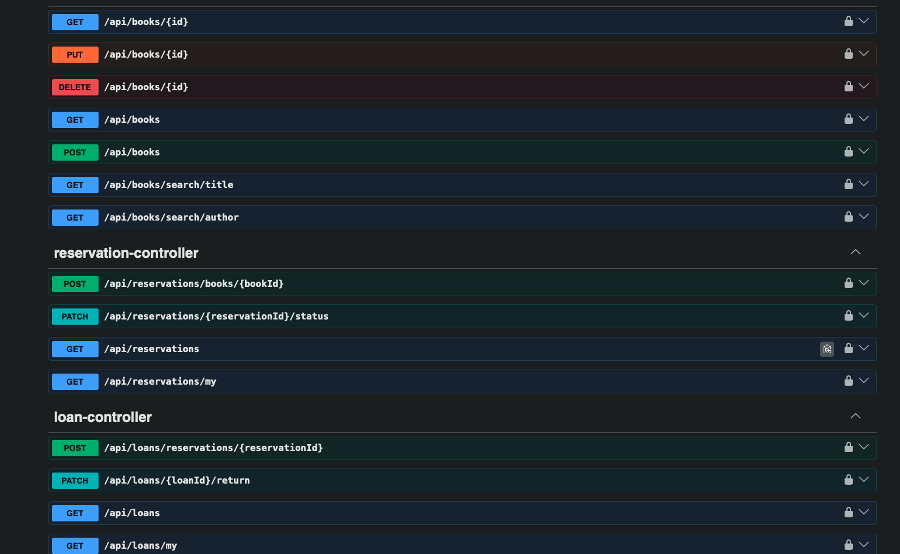

### Autoryzacja JWT w Swaggerze

Po zalogowaniu token JWT jest wklejany w oknie `Authorize`, dzięki czemu można testować endpointy chronione rolami.

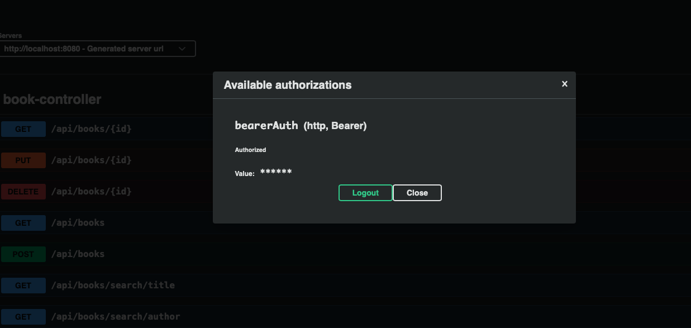

### Utworzenie Rezerwacji

Użytkownik tworzy rezerwację książki. Nowa rezerwacja otrzymuje status `PENDING`.

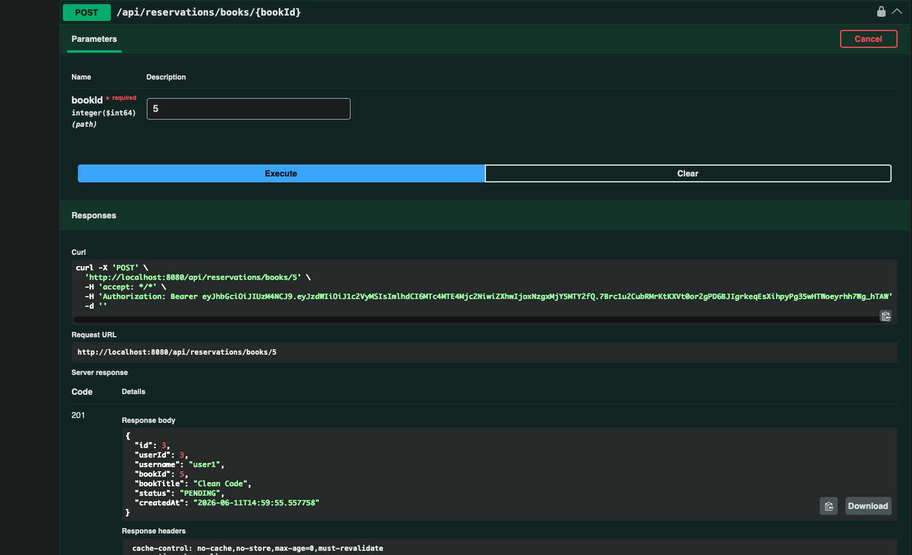

### Lista Rezerwacji

Administrator może przeglądać wszystkie rezerwacje użytkowników i na tej podstawie decydować o akceptacji.

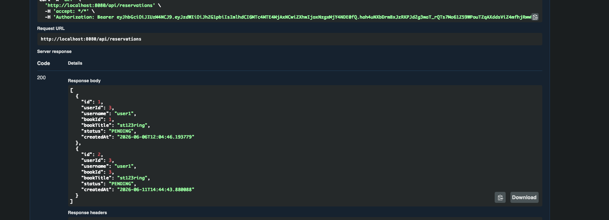

### Akceptacja Rezerwacji

Administrator zmienia status rezerwacji na `ACCEPTED`, co pozwala utworzyć wypożyczenie.

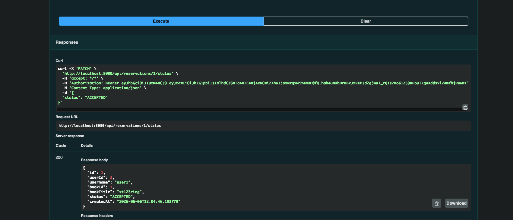

### Utworzenie Wypożyczenia

Administrator tworzy wypożyczenie na podstawie zaakceptowanej rezerwacji. Wypożyczenie otrzymuje status `ACTIVE`.

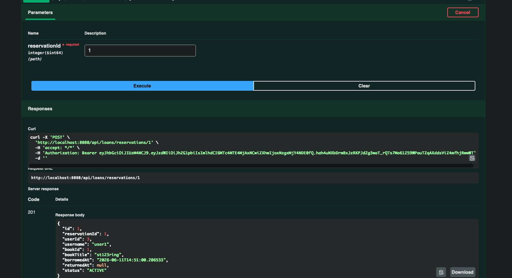

### Historia Wypożyczeń Użytkownika

Użytkownik może sprawdzić swoje wypożyczenia przez endpoint `/api/loans/my`.

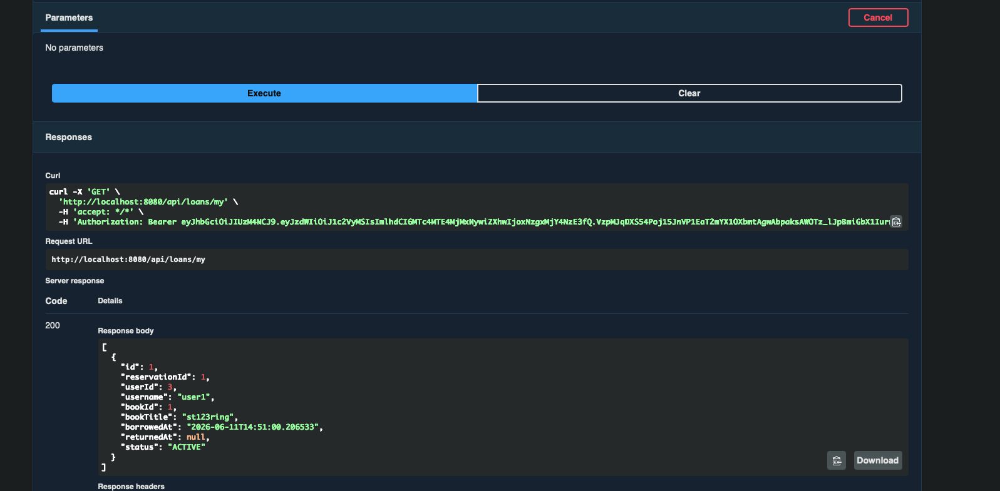

### Zwrot Książki

Administrator oznacza wypożyczenie jako zwrócone. W odpowiedzi widoczny jest status `RETURNED` oraz data `returnedAt`.

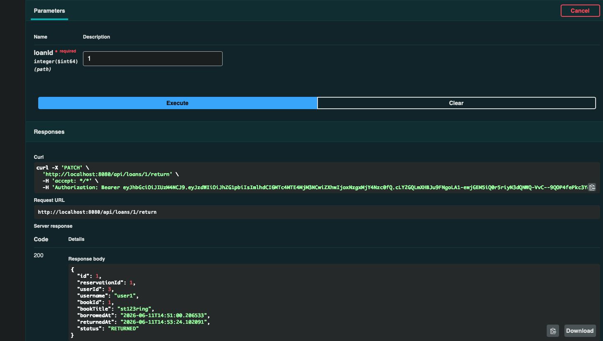

### Wynik Testów

Projekt zawiera testy jednostkowe oraz testy kontrolerów. Wynik `BUILD SUCCESS` potwierdza poprawne wykonanie zestawu testów.

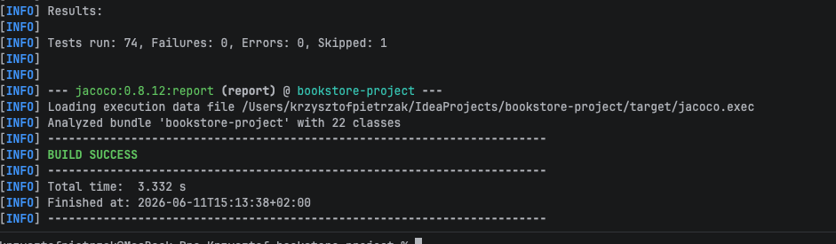

### Raport Pokrycia JaCoCo

Raport JaCoCo potwierdza pokrycie powyżej wymaganego progu 80% dla mierzonej logiki aplikacji.

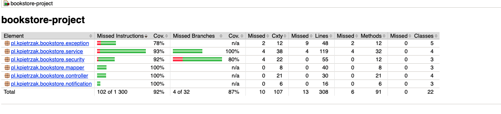

### Uruchomienie w Docker Compose

Kontenery `bookstore-app` i `bookstore-postgres` działają równolegle, a aplikacja Spring Boot jest wystawiona na porcie `8080`.

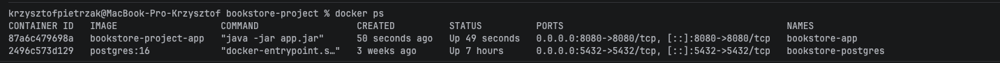

## ERD / Schemat Bazy Danych

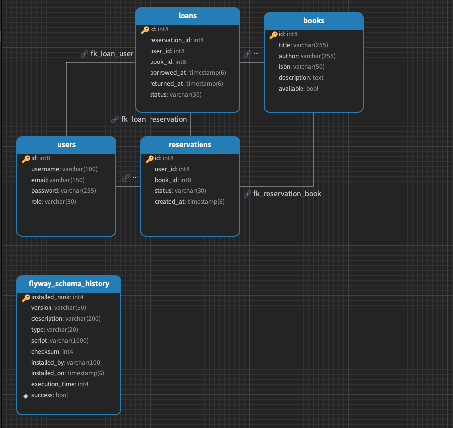

Diagram ERD przedstawia tabele `users`, `books`, `reservations`, `loans` oraz techniczną tabelę `flyway_schema_history`. Jeden użytkownik może mieć wiele rezerwacji i wypożyczeń. Jedna książka może występować w wielu rezerwacjach i wypożyczeniach historycznych. Każde wypożyczenie jest powiązane z jedną zaakceptowaną rezerwacją.

## Migracje Flyway

Schemat bazy danych jest tworzony przez migracje Flyway. Migracje znajdują się w:

```text
src/main/resources/db/migration/V1__init_database.sql
src/main/resources/db/migration/V2__create_loans_table.sql
```

Flyway wykonuje migracje automatycznie przy starcie aplikacji. Hibernate dodatkowo waliduje zgodność encji ze schematem bazy danych.

## Wzorzec Projektowy i Polimorfizm

Projekt wykorzystuje wzorzec Strategy Pattern w module `notification`.

- `NotificationStrategy` jest interfejsem strategii.
- `ConsoleNotificationStrategy` i `EmailNotificationStrategy` są różnymi implementacjami strategii.
- `NotificationService` zależy od interfejsu `NotificationStrategy`, a nie od konkretnej klasy.

Dzięki temu sposób wysyłania powiadomień można zmienić bez zmieniania logiki rezerwacji. Rozwiązanie pokazuje też polimorfizm, ponieważ różne implementacje strategii mogą być używane przez ten sam interfejs.

## Uruchamianie Lokalne

Wymagania:

- Java 21
- Maven albo Maven Wrapper
- Docker

Uruchom aplikację razem z PostgreSQL w Dockerze:

```bash
docker compose up --build
```

Alternatywnie możesz uruchomić tylko PostgreSQL w Dockerze i aplikację Spring Boot lokalnie:

```bash
docker compose up -d db
./mvnw spring-boot:run
```

Adres aplikacji:

```text
http://localhost:8080
```

Adres Swaggera:

```text
http://localhost:8080/swagger-ui.html
```

## Docker Compose

Plik `docker-compose.yml` uruchamia aplikację Spring Boot oraz bazę PostgreSQL.

```bash
docker compose up --build
```

Po uruchomieniu kontenerów aplikacja jest dostępna pod adresem:

```text
http://localhost:8080
```

Swagger UI jest dostępny pod adresem:

```text
http://localhost:8080/swagger-ui.html
```

Serwisy Docker Compose:

- `app` - aplikacja Spring Boot
- `db` - baza danych PostgreSQL

Konfiguracja połączenia z bazą jest przekazywana przez zmienne środowiskowe `SPRING_DATASOURCE_URL`, `SPRING_DATASOURCE_USERNAME` i `SPRING_DATASOURCE_PASSWORD`. Lokalnie aplikacja nadal może być uruchamiana przez Maven, ponieważ `application.properties` zawiera wartości domyślne dla środowiska lokalnego.

## Domyślne Konto Administratora

Aplikacja tworzy domyślne konto administratora przy starcie, jeśli takie konto jeszcze nie istnieje:

```text
username: admin
password: admin123
role: ADMIN
```

## Testy

Projekt zawiera:

- Testy serwisów
- Testy kontrolerów
- Testy mapperów
- Testy security
- Testy filtra JWT
- Testy workflow wypożyczeń
- Testy modułu notification
- Testy globalnej obsługi wyjątków

Uruchomienie testów:

```bash
./mvnw clean test
```

Aktualny wynik testów:

```text
Tests run: 74, Failures: 0, Errors: 0, Skipped: 1
BUILD SUCCESS
```

Projekt jest skonfigurowany pod Javę 21. Przy uruchamianiu testów na nowszym JDK mogą wystąpić problemy kompatybilności agentów Mockito albo JaCoCo. Oczekiwanym środowiskiem testowym jest JDK 21.

## JaCoCo Coverage

JaCoCo generuje raport pokrycia testami podczas fazy testów Maven:

```bash
./mvnw clean test
```

Lokalizacja raportu:

```text
target/site/jacoco/index.html
```

Aktualny wygenerowany raport pokazuje pokrycie powyżej 80% dla mierzonej logiki aplikacji:

```text
Instruction coverage: 92.15%
Line coverage: 95.78%
Branch coverage: 87.50%
```

## Wykluczenia JaCoCo

Z raportu pokrycia wykluczono klasy techniczne i boilerplate:

- Klasy DTO
- Encje
- Enumy
- Klasy konfiguracyjne
- Główną klasę startową Spring Boot

Pokrycie jest liczone dla kodu zawierającego logikę aplikacji, czyli między innymi dla serwisów, kontrolerów, mapperów, security, obsługi wyjątków i powiadomień.

## Struktura Projektu

```text
src/main/java/pl/kpietrzak/bookstore
├── config        # Konfiguracja aplikacji, OpenAPI i security
├── controller    # Kontrolery REST
├── dto           # Obiekty request/response API
├── entity        # Encje JPA
├── enums         # Role i statusy rezerwacji
├── exception     # Wyjątki i globalna obsługa błędów
├── mapper        # Mapowanie DTO i encji
├── notification  # Strategy Pattern dla powiadomień
├── repository    # Repozytoria Spring Data JPA
├── security      # JWT i UserDetailsService
└── service       # Logika biznesowa
```

## Przykładowe Requesty

### Rejestracja Użytkownika

```json
{
  "username": "user1",
  "email": "user1@test.pl",
  "password": "secret123"
}
```

### Logowanie

```json
{
  "username": "admin",
  "password": "admin123"
}
```

### Dodanie Książki

```json
{
  "title": "Clean Code",
  "author": "Robert C. Martin",
  "isbn": "9780132350884",
  "description": "Book about clean code"
}
```

### Zmiana Statusu Rezerwacji

Dostępne statusy to `PENDING`, `ACCEPTED`, `REJECTED` i `CANCELLED`.

```json
{
  "status": "ACCEPTED"
}
```

### Utworzenie Wypożyczenia

Wypożyczenie tworzy administrator na podstawie zaakceptowanej rezerwacji:

```http
POST /api/loans/reservations/1
```

Przykładowa odpowiedź:

```json
{
  "id": 1,
  "reservationId": 1,
  "userId": 3,
  "username": "user1",
  "bookId": 1,
  "bookTitle": "Clean Code",
  "borrowedAt": "2026-06-11T14:51:00.206533",
  "returnedAt": null,
  "status": "ACTIVE"
}
```

### Zwrot Książki

Zwrot wykonuje administrator:

```http
PATCH /api/loans/1/return
```

Przykładowa odpowiedź:

```json
{
  "id": 1,
  "reservationId": 1,
  "userId": 3,
  "username": "user1",
  "bookId": 1,
  "bookTitle": "Clean Code",
  "borrowedAt": "2026-06-11T14:51:00.206533",
  "returnedAt": "2026-06-11T14:53:24.102091",
  "status": "RETURNED"
}
```

## Status Projektu

Projekt implementuje wymagane funkcjonalności backendowe: REST API, JWT authentication, RBAC, PostgreSQL, Flyway, Swagger, rezerwacje, wypożyczenia, zwroty, testy, raport JaCoCo, Strategy Pattern, polimorfizm oraz dokumentację projektu ze screenami.
